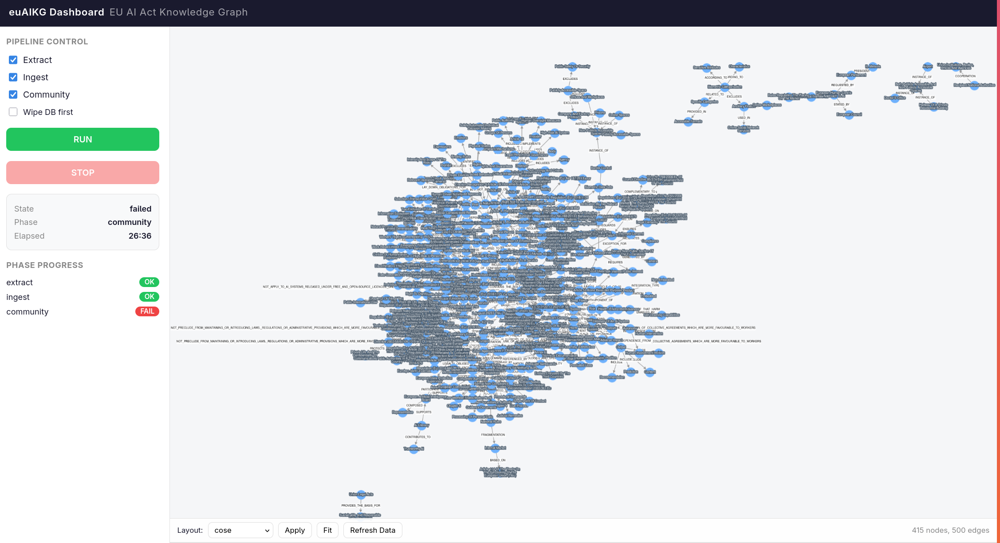
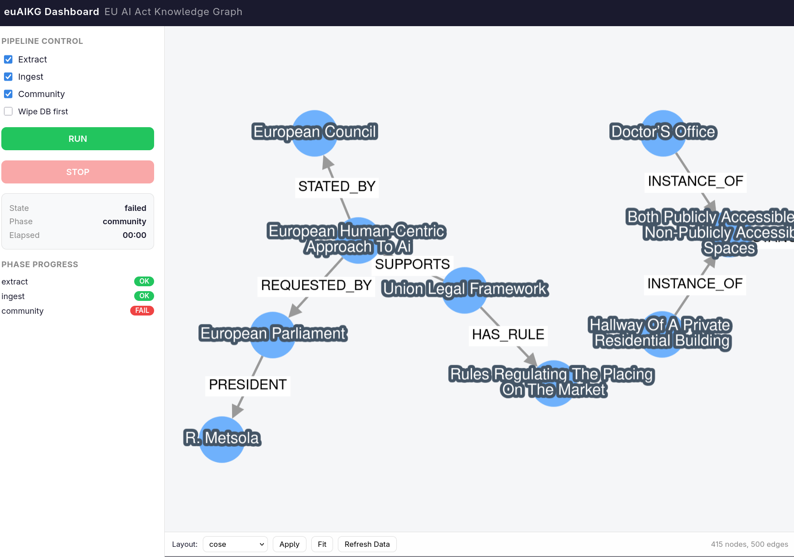

# ckAIKG — AIDE global problem Knowledge Graph

Automated knowledge graph construction pipeline that transforms the EU AI Act text into a queryable Neo4j graph database with interactive visualization.

## Authors

**Yungi Hong**\*, **Hyoseok Jang**\*, Haneol Cho, Sangchul Lee<sup>&dagger;</sup>, Nabil Belacel<sup>&dagger;</sup>, Chansoo Kim<sup>&dagger;</sup>

<sub>\* Equal contribution &nbsp;&nbsp; <sup>&dagger;</sup> Cross-affiliation</sub>

## Screenshots

| Graph Overview | Graph Detail |
|:--:|:--:|
|  |  |

*euAIKG Dashboard — interactive knowledge graph visualization with pipeline controls and real-time progress tracking.*

## Architecture

```
EU_ai.txt
    |
    v
 [Chunking] ── token-aware splitting (Qwen3 tokenizer)
    |
    v
 [Extraction] ── vLLM (Qwen3-14B-AWQ) primary + Gemini fallback
    |
    v
 [Ingestion] ── pickle → Neo4j graph documents
    |
    v
 [Community] ── embedding (multilingual-e5-large) → KNN + WCC → Gemini entity resolution → APOC merge
    |
    v
 [Visualization] ── Flask + Cytoscape.js dashboard
```

### Pipeline Phases

| Phase | Module | Description |
|-------|--------|-------------|
| **Extract** | `extraction.py` | LLM-based graph extraction from text chunks. Uses vLLM (local Qwen3-14B-AWQ) as primary, falls back to Gemini API for failed chunks. Outputs per-page pickle + JSONL files. |
| **Ingest** | `ingestion.py` | Loads `graph_all.pkl` and pushes graph documents into Neo4j via LangChain's `add_graph_documents`. |
| **Community** | `community.py` | Generates embeddings with `intfloat/multilingual-e5-large`, runs KNN similarity + Weakly Connected Components (WCC) for community detection, then uses Gemini for entity resolution and APOC `mergeNodes` for deduplication. |
| **Serve** | `visualization.py` | Flask server with a Cytoscape.js dashboard for interactive graph exploration. Includes pipeline control API with SSE log streaming. |

### Key Design Decisions

- **Dual-LLM extraction**: Local vLLM for throughput, Gemini API as fallback for robustness
- **Resumability**: Each phase checks for prior completion (existing pickle files, `__Entity__` node count, WCC property) and skips if already done. Use `--no-wipe` to resume.
- **Token-aware chunking**: Uses the actual Qwen3 tokenizer for accurate chunk boundaries

## Prerequisites

- Python 3.9+
- Docker (for Neo4j)
- NVIDIA GPU (for vLLM and CUDA embeddings; CPU fallback available for embeddings)
- Google Gemini API key

## Quick Start

```bash
# Automated setup (Neo4j, vLLM, venv, .env)
bash setup.sh

# Or step by step:
python3 -m venv .venv && source .venv/bin/activate
pip install -r requirements.txt
cp .env.example .env  # fill in NEO4J_PASSWORD and GOOGLE_API_KEY
```

### Start Infrastructure

```bash
# Neo4j (with APOC plugin)
docker run -d --name euaikg-neo4j \
  -p 7474:7474 -p 7687:7687 \
  -e NEO4J_AUTH=neo4j/your-password \
  -e 'NEO4J_PLUGINS=["apoc"]' \
  neo4j:5-community

# vLLM (requires GPU)
vllm serve Qwen/Qwen3-14B-AWQ \
  --quantization awq_marlin \
  --max-model-len 4096 \
  --port 8000 \
  --enable-auto-tool-choice \
  --tool-call-parser hermes
```

## Usage

```bash
# Full pipeline (extract → ingest → community → serve)
python main.py

# Resume without wiping DB
python main.py --no-wipe

# Run specific phase
python main.py --phase extract
python main.py --phase ingest
python main.py --phase community

# Dashboard only
python main.py --phase serve --port 8080

# Skip visualization
python main.py --no-serve
```

### CLI Options

| Option | Default | Description |
|--------|---------|-------------|
| `--phase` | `all` | Run a specific phase: `extract`, `ingest`, `community`, `serve` |
| `--no-wipe` | off | Skip DB wipe (resume from previous run) |
| `--no-serve` | off | Skip visualization server |
| `--port` | `5000` | Visualization server port |
| `--host` | `127.0.0.1` | Visualization server host |
| `--limit` | `500` | Cytoscape graph query LIMIT |

## Dashboard

The web dashboard (default `http://localhost:5000`) provides:

- **Interactive graph viewer** — Cytoscape.js with pan/zoom and node labels
- **Pipeline controls** — Start/stop pipeline from the browser
- **SSE log stream** — Real-time pipeline output
- **Status panel** — Current phase, elapsed time, completed phases

For remote servers, use SSH tunneling:
```bash
ssh -L 5000:127.0.0.1:5000 user@server
```

### Offline Network UI

A self-contained static viewer under `network_ui/` presents the AIDE relationship
networks (GDP variables, global industry, case-law references, trade-CO2,
Pacific trade) without needing the pipeline or Neo4j.

```bash
xdg-open network_ui/network_ui.html
# or serve statically:
python -m http.server --directory network_ui 8001
```

Assets use relative paths (`lib/`, `outputs_nsga/`) — keep the directory intact.

An additional standalone viewer `network_ui/nsga_front_replay.html` replays the
NSGA-II Pareto front evolution using `nsga_front_map_all.csv` in the same
folder. Because it loads the CSV via `fetch`, serve it through a local HTTP
server rather than opening the file directly:

```bash
python -m http.server --directory network_ui 8001
# then visit http://localhost:8001/nsga_front_replay.html
```

## Configuration

All settings are configured via `.env` (see `.env.example`):

| Variable | Default | Description |
|----------|---------|-------------|
| `NEO4J_URI` | `neo4j://127.0.0.1:7687` | Neo4j Bolt URI |
| `NEO4J_USER` | `neo4j` | Neo4j username |
| `NEO4J_PASSWORD` | (required) | Neo4j password |
| `GOOGLE_API_KEY` | (required) | Google Gemini API key |
| `VLLM_BASE_URL` | `http://localhost:8000/v1` | vLLM OpenAI-compatible endpoint |
| `VLLM_MODEL_ID` | `Qwen/Qwen3-14B-AWQ` | Model served by vLLM |
| `DOCUMENT_PATH` | `EU_ai.txt` | Input document path |
| `CHUNK_SIZE` | `350` | Tokens per chunk |
| `CHUNK_OVERLAP` | `75` | Token overlap between chunks |
| `MAX_WORKERS` | `4` | Concurrent extraction threads |
| `EXTRACTION_TIMEOUT` | `300` | Per-chunk timeout (seconds) |
| `EMBEDDING_MODEL` | `intfloat/multilingual-e5-large` | HuggingFace embedding model |
| `EMBEDDING_DEVICE` | `cuda` | Embedding compute device |
| `SIMILARITY_THRESHOLD` | `0.95` | KNN similarity cutoff for communities |
| `WORD_EDIT_DISTANCE` | `3` | Text distance threshold for duplicate candidates |
| `GEMINI_EXTRACTION_MODEL` | `gemini-2.5-pro` | Gemini model for extraction fallback |
| `GEMINI_RESOLUTION_MODEL` | `gemini-2.5-pro` | Gemini model for entity resolution |

## Project Structure

```
euAIKG/
├── main.py              # CLI entrypoint
├── pipeline.py          # Pipeline orchestration (sync + threaded)
├── config.py            # Environment config and validation
├── db.py                # Neo4j driver lifecycle
├── chunking.py          # Token-aware text splitting
├── extraction.py        # vLLM + Gemini graph extraction
├── ingestion.py         # Pickle → Neo4j ingestion
├── community.py         # Embedding, community detection, entity resolution
├── visualization.py     # Flask server + dashboard API
├── validate.py          # Mock/real validation script
├── setup.sh             # Automated environment setup
├── templates/
│   └── dashboard.html   # Cytoscape.js dashboard
├── network_ui/          # Offline AIDE network visualization bundle
│   ├── network_ui.html  # Entry page — 5 graph tabs
│   ├── graph_ui.html    # Embedded vis-network viewer
│   ├── nsga_front_replay.html    # NSGA Pareto-front replay viewer
│   ├── nsga_front_map_all.csv    # NSGA front map data (gen / nd_rank / GDP / GHG)
│   ├── lib/             # vis-network 9.1.2 assets
│   └── outputs_nsga/    # Rendered graph images
├── tests/
│   ├── conftest.py
│   └── ...
├── requirements.txt
├── .env.example
└── EU_ai.txt            # Input document (not tracked)
```

## Testing

```bash
# Mock tests (no external services needed)
python validate.py --mock

# Real integration tests (requires Neo4j + vLLM running)
python validate.py --real

# pytest directly
pytest tests/ -v
```

## Tech Stack

- **LLM Extraction**: [vLLM](https://github.com/vllm-project/vllm) + [Qwen3-14B-AWQ](https://huggingface.co/Qwen/Qwen3-14B-AWQ)
- **Fallback/Resolution**: [Google Gemini API](https://ai.google.dev/)
- **Graph DB**: [Neo4j](https://neo4j.com/) Community Edition + [APOC](https://neo4j.com/labs/apoc/)
- **Framework**: [LangChain](https://www.langchain.com/) (graph transformers, embeddings, Neo4j integration)
- **Embeddings**: [intfloat/multilingual-e5-large](https://huggingface.co/intfloat/multilingual-e5-large)
- **Community Detection**: [Neo4j Graph Data Science](https://neo4j.com/docs/graph-data-science/) (KNN + WCC)
- **Visualization**: [Flask](https://flask.palletsprojects.com/) + [Cytoscape.js](https://js.cytoscape.org/)

## License

TBD
